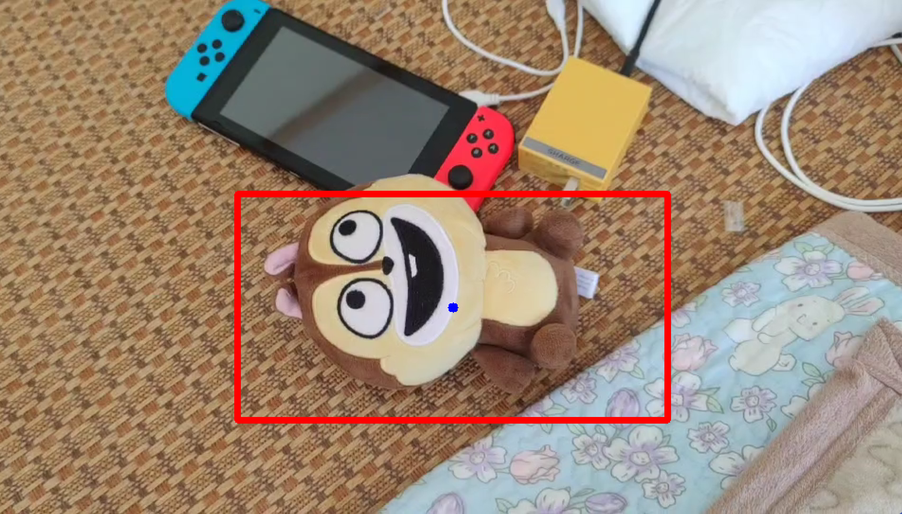

<h1 align="center">
OneLoc: One-Shot General Object Localization
</h1>

<div align="center">
<h3>
<a href="https://qq456cvb.github.io">Yang You</a>, Zhuochen Miao, Kai Xiong, Weiming Wang, <a href="https://www.mvig.org/">Cewu Lu</a>
<br>
<br>
<a href='https://arxiv.org/abs/2211.13392'>
  
</a>
<a href='#'>
  
</a>
<a href='#'>

</a>
<br>
</h3>
</div>
 
This paper presents a general one-shot object localization algorithm called OneLoc. Current one-shot object localization or detection methods either rely on a slow exhaustive feature matching process or lack the ability to generalize to novel objects. In contrast, our proposed OneLoc algorithm efficiently finds the object center and bounding box size by a special voting scheme. To keep our method scale-invariant, only unit center offset directions and relative sizes are estimated. A novel dense equalized voting module is proposed to better locate small texture-less objects. Experiments show that the proposed method achieves state-of-the-art overall performance on two datasets: OnePose dataset and LINEMOD dataset. In addition, our method can also achieve one-shot multi-instance detection and non-rigid object localization.

## Run Demo
We provide a demo, detecting a novel toy bear. The reference video is stored in `data/ref.mp4`, and the test sequence is stored in `data/test.mp4`.

To run the code, install the necessary packages and modify L27 of `helper_math.cuh` to point to the correct location of CUDA.

Then run,
```
python kp_server.py
```
and run
```
python train.py  # in another terminal
```
After training for about 10 epochs, you will see the following detection results:
<p align='center'>
 </img>
</p>

Of course, you can capture your own object, and replace `ref.mp4`/`test.mp4`. The only requirement is to ensure that the object occupies the whole image in `ref.mp4`; if not, you may have to annotate the bounding box and modify L42 of `dataset.py` to generate the correct voting target. Have fun!

## Full Code
Coming soon.